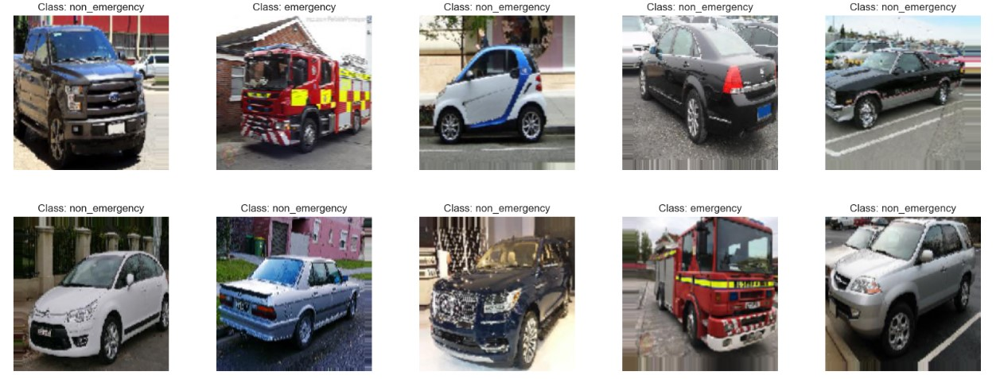
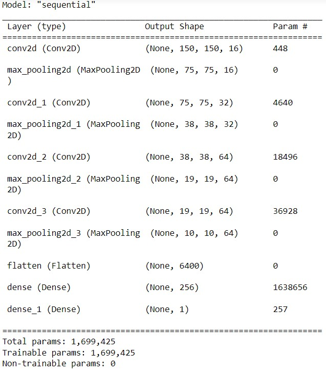
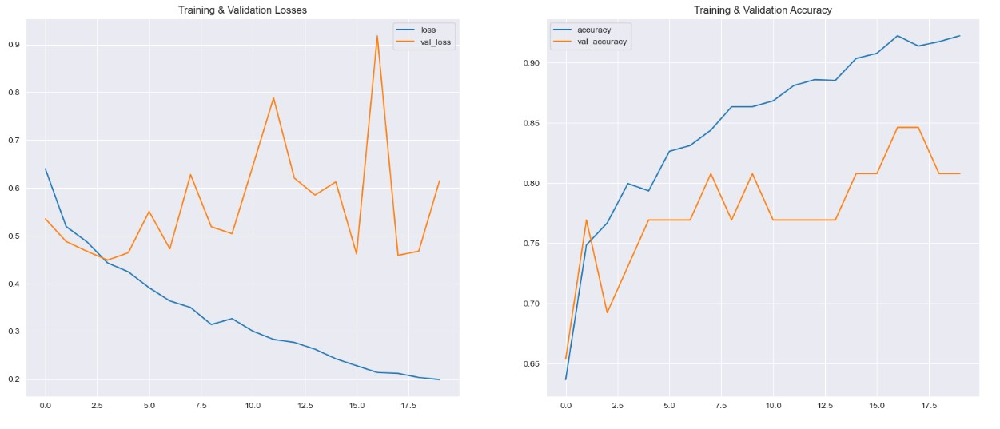
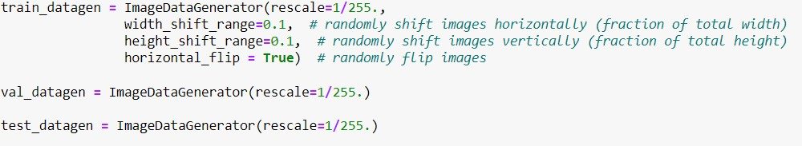

## Authors

- [@beersk1](https://www.github.com/beersk1)

## Table of Contents

  - [Why CNN?](#why-cnn)
  - [Data source](#data-source)
  - [Methods](#methods)
  - [Tech Stack](#tech-stack)
  - [Data Augmentation](#data-augmentation)
  - [Improvements](#limitation-and-what-can-be-improved)
  - [Explore the notebook](#explore-the-notebook)
  - [Deployment on streamlit](#deployment-on-streamlit)
  - [App deployed on Streamlit](#app-deployed-on-streamlit)

## Why CNN?

- A CNN (Convolutional Neural Network) is a type of deep neural network used for image and video recognition, natural language processing, and other high-dimensional data applications.

- A CNN learns features automatically from the input data, making it different from other neural networks.

- A typical CNN consists of several layers, including convolutional layers, pooling layers, and fully connected layers.

- The convolutional layers apply learnable filters to the input data to extract relevant features.

- The pooling layers downsample the feature maps obtained from the convolutional layers, reducing their spatial size and complexity.

- The fully connected layers take the output of the convolutional and pooling layers and use it to classify the input data.

- CNNs learn hierarchical representations of input data, allowing them to recognize complex patterns and structures in the data.

- CNNs have achieved state-of-the-art performance on a wide range of image recognition tasks, including object detection, segmentation, and classification.

## Data source

- [Emergency Vehicles Identification](https://www.kaggle.com/datasets/abhisheksinghblr/emergency-vehicles-identification)

## Methods

- Data Gathering 
- Data Augmentation 
- Model Selection 
- Model Training 
- S3 bucket model hosting
- Model deployment

## Tech Stack

- Python (refer to requirement.txt for the packages used in this project)
- Streamlit (Interface for the model)
- AWS S3 (Model Storage)

| Model                     | Accuracy Score |
|-------------------	      |------------------	|
| Custom CNN Model          |88% | 

- **Custom Model**
The summary of the CNN model shows that it consists of four convolutional layers, each followed by a max pooling layer. The first two convolutional layers have 16 and 32 filters respectively, while the last two have 64 filters each. The max pooling layers reduce the spatial dimensions of the feature maps by half. The model also includes two fully connected layers with 256 and 1 neurons respectively. The total number of trainable parameters in the model is 1,699,425. This CNN model can be used for image classification tasks, and its architecture can be further modified to suit specific requirements.

## Data Augmentation

- Data augmentation is a technique used in machine learning to increase dataset size by creating new data from existing data through transformations.
- It reduces overfitting by exposing the model to a larger and diverse set of data, helping it to generalize better on new data.
- It addresses class imbalance in datasets by augmenting the samples of minority classes, making the model recognize all classes equally.
- It improves model performance by introducing more variability and diversity in the data, helping the model to learn more general and robust features.
- Data augmentation is widely used in various applications, including image recognition, natural language processing, and speech recognition to improve the accuracy and robustness of machine learning models.

##

- **Evaluaion Metric used: Accuracy Score**
- **Why choose Accuracy as an evaluation metric: **

 Accuracy is the most straightforward evaluation metric that measures the percentage of correct predictions made by the model. It is calculated by dividing the number of correctly predicted instances by the total number of instances in the dataset.

Since my classes are balanced, accuracy will be an appropriate metric to use because it measures the overall correctness of your model without bias towards any specific class.
However, you may also want to consider using other metrics such as precision, recall, or F1 score, which can provide more insights into the model's performance on individual classes.

 Precision: Precision is a metric that measures the proportion of correctly predicted positive instances over the total number of instances predicted as positive. In other words, precision measures how accurate the model's positive predictions are. A high precision means that the model is very good at predicting positive instances, and a low precision means that the model is making many false positive predictions.

Recall: Recall is a metric that measures the proportion of correctly predicted positive instances over the total number of actual positive instances in the dataset. In other words, recall measures how well the model identifies positive instances. A high recall means that the model is very good at identifying positive instances, and a low recall means that the model is missing many actual positive instances.

F1 Score: The F1 score is the harmonic mean of precision and recall. It combines both metrics into a single score that balances both precision and recall. The F1 score is a good metric to use when you want to evaluate the overall performance of a model and compare it to other models. The F1 score ranges from 0 to 1, with a higher value indicating better performance.

## Limitation and what can be improved

- Hyperparameter tuning.
- Transfer Learning using ResNet50, VGG16, InceptionV3
- Retrain the model without the least predictive features

## Explore the notebook

To explore the notebook file [here](https://nbviewer.org/github.com/beersk1/Emergency_Vehicle_Classification/blob/main/Emergency_Vehicle_Classification_CNN.ipynb)

## Deployment on streamlit

To deploy this project on streamlit share, follow these steps:

- first, make sure you upload your files on Github, including a requirements.txt file
- go to [streamlit share](https://share.streamlit.io/)
- login with Github, Google, etc.
- click on new app button
- select the Github repo name, branch, python file with the streamlit codes
- click advanced settings, select python version 3.9 and add the secret keys if your model is stored on AWS or GCP bucket
- then save and deploy!

## App deployed on Streamlit

Video to gif [tool](https://ezgif.com/)

## Contribution

Pull requests are welcome! For major changes, please open an issue first to discuss what you would like to change or contribute.

## License

MIT License

Copyright (c) 2022 Stern Semasuka

Permission is hereby granted, free of charge, to any person obtaining a copy
of this software and associated documentation files (the "Software"), to deal
in the Software without restriction, including without limitation the rights
to use, copy, modify, merge, publish, distribute, sublicense, and/or sell
copies of the Software, and to permit persons to whom the Software is
furnished to do so, subject to the following conditions:

The above copyright notice and this permission notice shall be included in all
copies or substantial portions of the Software.

THE SOFTWARE IS PROVIDED "AS IS", WITHOUT WARRANTY OF ANY KIND, EXPRESS OR
IMPLIED, INCLUDING BUT NOT LIMITED TO THE WARRANTIES OF MERCHANTABILITY,
FITNESS FOR A PARTICULAR PURPOSE AND NONINFRINGEMENT. IN NO EVENT SHALL THE
AUTHORS OR COPYRIGHT HOLDERS BE LIABLE FOR ANY CLAIM, DAMAGES OR OTHER
LIABILITY, WHETHER IN AN ACTION OF CONTRACT, TORT OR OTHERWISE, ARISING FROM,
OUT OF OR IN CONNECTION WITH THE SOFTWARE OR THE USE OR OTHER DEALINGS IN THE
SOFTWARE.

Learn more about [MIT](https://choosealicense.com/licenses/mit/) license

Badge [source](https://shields.io/)
